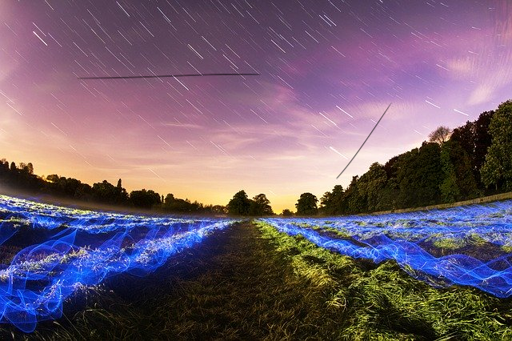
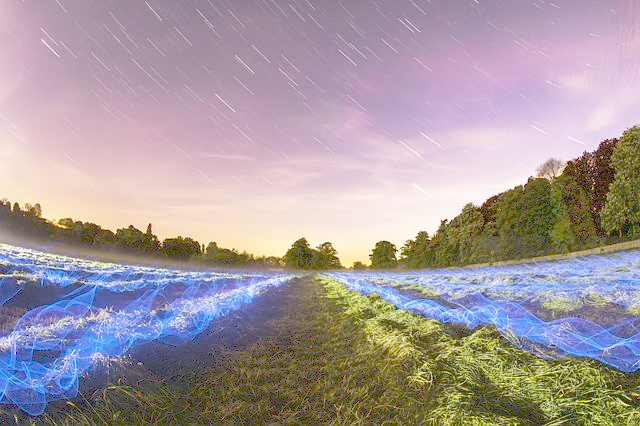

# bmp-image comparison library

This library is designed to compare two BMP images and returns an percentage of how similar they are to each other.
Currently there is only one way of comparing images, but more will be added in the future.

## Info

This is a rather small project for me to learn more about C and image processing. As its a lot of fun to write C.
But I think this gives and pretty good insight on how to read BMP files and do different things with them.
If you are interested in more info I have an image in /info about BMP headers.

## Installation

To install the library, simply run the following commands:

Make sure you have an c compiler installed and make (for Makefile).

1. Clone the repository

```bash
git clone https://github.com/Blize/bmp-image-compare.git
```

2. Build the project

```bash
make
```

3. Run the executable

```bash
./bmp_compare static/1.bmp static/1_lines.bmp
```

## Usage / Current Features

The library currently only supports only two methods.

The first method is comparing every R / G / B value of every pixel between the two images. After that it sums them and divides by the total amount of pixels to get the percentage.
With that we get similarity values for R / G / B and overall.

The first method is good for comparing images that are the same, but have been modified in some way, like adding lines to the image.
For example comparing this image...

...with this image...


...will gives us an high `Image Comparison Results every RGB`, since the only difference is the lines added to the second image.
Example output:

```
-------------- BMP File Header --------------
File Path: static/1.bmp
File Type: 4d42
File Size: 818058 bytes
Pixel Data Offset: 138 bytes
Image Width: 640 pixels
Image Height: 426 pixels
Bit Count: 24 (should be 24 for 24-bit)
Compression: 0 (should be 0 for no compression)
Image Size: 817920 bytes (biSizeImage)
---------------------------------------------

-------------- BMP File Header --------------
File Path: static/1_lines.bmp
File Type: 4d42
File Size: 818058 bytes
Pixel Data Offset: 138 bytes
Image Width: 640 pixels
Image Height: 426 pixels
Bit Count: 24 (should be 24 for 24-bit)
Compression: 0 (should be 0 for no compression)
Image Size: 817920 bytes (biSizeImage)
---------------------------------------------

---- Image Comparison Results every RGB -----
Average Red Similarity: 99.86%
Average Green Similarity: 99.88%
Average Blue Similarity: 99.87%
Average Overall Similarity: 99.87%
----------------------------------------------

---- Image Comparison Results Color Shift ----
Average Red Brightness Shift: 99.86%
Average Green Brightness Shift: 99.88%
Average Blue Brightness Shift: 99.87%
Average Overall Brightness Shift: 99.87%
----------------------------------------------
```

But if we now have the exact same image with different brightness.
For example comparing this image...

...with this image...

...will gives us an low `Image Comparison Results every RGB`, since every pixel is different. But the `Image Comparison Results Color Shift` will be higher because we can calculate and check if the increase or decrease of every pixel is similar.

Example output:

```
-------------- BMP File Header --------------
File Path: static/1.bmp
File Type: 4d42
File Size: 818058 bytes
Pixel Data Offset: 138 bytes
Image Width: 640 pixels
Image Height: 426 pixels
Bit Count: 24 (should be 24 for 24-bit)
Compression: 0 (should be 0 for no compression)
Image Size: 817920 bytes (biSizeImage)
---------------------------------------------

-------------- BMP File Header --------------
File Path: static/1_brighter.bmp
File Type: 4d42
File Size: 818058 bytes
Pixel Data Offset: 138 bytes
Image Width: 640 pixels
Image Height: 426 pixels
Bit Count: 24 (should be 24 for 24-bit)
Compression: 0 (should be 0 for no compression)
Image Size: 817920 bytes (biSizeImage)
---------------------------------------------

---- Image Comparison Results every RGB -----
Average Red Similarity: 55.61%
Average Green Similarity: 51.58%
Average Blue Similarity: 59.40%
Average Overall Similarity: 55.53%
----------------------------------------------

---- Image Comparison Results Color Shift ----
Average Red Brightness Shift: 73.74%
Average Green Brightness Shift: 78.32%
Average Blue Brightness Shift: 74.29%
Average Overall Brightness Shift: 75.45%
----------------------------------------------
```

**Note** that the `Image Comparison Results Color Shift` can be lower than expected as the Algo is not perfect rn, but with every value higher than 60%
you can expect the image to be practically the same just with different brightness.

## Future Features

I want to add some more features in the future if I have time and motivation for this.
The main two are following:

- Add more ways of comparing images -> Recognize shapes
- Add different Bitmap file types support -> currently only supports 24-bit BMP files.
- Add different image resolutions support -> currently only supports the same resolutions of the two images.
